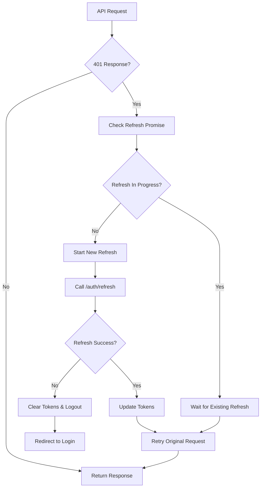

# Authentication System

This document explains the authentication implementation in this project, including security considerations and usage patterns.

## Overview

The authentication system provides:

- Secure token storage and management
- Automatic token refresh
- Race condition protection
- Protected routes

## Architecture

### Components

1. **HTTP Client** (`src/shared/lib/http/client.ts`)
   - Handles all API requests
   - Intercepts 401 responses
   - Manages token refresh

2. **Token Storage** (`src/shared/lib/storage/token-storage.ts`)
   - Secure token storage in memory and sessionStorage
   - Token retrieval and clearing

3. **Auth Feature** (`src/features/auth/`)
   - Authentication hooks and logic
   - Login/logout functionality

4. **Protected Routes** (`src/app/routes/protected-route.tsx`)
   - Route guards for authenticated pages

## Token Storage Strategy

### Token Storage

- **Storage**: localStorage
- **Purpose**: Persist authentication tokens across page refreshes
- **Security**: Vulnerable to XSS attacks, but provides persistence
- **Lifetime**: Persists until explicitly cleared or expired

### Access Tokens

- **Storage**: localStorage with expiration tracking
- **Purpose**: Short-lived authentication for API requests
- **Expiration**: Automatically checked before use (60-second buffer for clock skew)
- **Lifetime**: Cleared when expired or on logout

### Refresh Tokens

- **Storage**: localStorage
- **Purpose**: Obtain new access tokens without re-login
- **Lifetime**: Persists until logout or refresh failure

### Production Recommendations

For production environments, consider:

- HTTP-only secure cookies for refresh tokens (instead of localStorage)
- CSRF protection
- HTTPS only
- Token rotation on each refresh
- Consider using memory storage for access tokens in high-security scenarios

## Token Refresh Flow



## Race Condition Protection

Multiple simultaneous API calls receiving 401 responses will:

1. Share the same refresh promise
2. Not trigger duplicate refresh requests
3. All wait for the single refresh to complete
4. Retry their original requests with new tokens

## Usage

### Basic Authentication

```typescript
import { useAuth } from '@/features/auth'
import type { LoginCredentials, RegisterCredentials } from '@/features/auth'

const LoginComponent = () => {
  const { login, register, logout, user, isAuthenticated, isLoading } = useAuth()

  const handleLogin = async (credentials: LoginCredentials) => {
    try {
      await login(credentials)
      // User is now authenticated
    } catch (error) {
      // Handle login error
      console.error('Login failed:', error)
    }
  }

  const handleRegister = async (credentials: RegisterCredentials) => {
    try {
      await register(credentials)
      // User is registered and authenticated
    } catch (error) {
      // Handle registration error
      console.error('Registration failed:', error)
    }
  }

  const handleLogout = async () => {
    try {
      await logout()
      // User is logged out and tokens cleared
    } catch (error) {
      // Handle logout error
      console.error('Logout failed:', error)
    }
  }

  if (isLoading) {
    return <div>Loading...</div>
  }

  return (
    <div>
      {isAuthenticated ? (
        <div>
          <p>Welcome, {user?.name}</p>
          <button onClick={handleLogout}>Logout</button>
        </div>
      ) : (
        <div>
          <button onClick={() => handleLogin({ email: '', password: '' })}>
            Login
          </button>
          <button onClick={() => handleRegister({ email: '', password: '', name: '' })}>
            Register
          </button>
        </div>
      )}
    </div>
  )
}
```

### Protected Routes

```typescript
import { useAuth } from '@/features/auth'
import { Navigate } from 'react-router'
import { paths } from '@/shared/config/routes'

const ProtectedPage = () => {
  const { isAuthenticated, isLoading } = useAuth()

  if (isLoading) {
    return <div>Loading...</div>
  }

  if (!isAuthenticated) {
    return <Navigate to={paths.login} replace />
  }

  return <div>Protected content</div>
}
```

**Note:** The `ProtectedRoute` component in `src/app/routes/protected-route.tsx` provides a reusable wrapper for protected routes.

### Using useRequireAuth Hook

```typescript
import { useRequireAuth } from '@/features/auth'

const ProtectedPage = () => {
  // Automatically redirects to login if not authenticated
  const { isAuthenticated, isLoading } = useRequireAuth('/login')

  if (isLoading) {
    return <div>Loading...</div>
  }

  return <div>Protected content</div>
}
```

### Checking Authentication Status

```typescript
import { useAuth } from '@/features/auth'

const MyComponent = () => {
  const { isAuthenticated, user, isLoading } = useAuth()

  if (isLoading) {
    return <div>Loading...</div>
  }

  if (!isAuthenticated) {
    return <div>Please log in</div>
  }

  return <div>Welcome, {user.name}!</div>
}
```

## API Integration

### Automatic Token Handling

The HTTP client automatically:

1. Adds access tokens to requests
2. Handles 401 responses
3. Refreshes tokens when needed
4. Retries failed requests

### Manual Token Management

```typescript
import { tokenStorage } from "@/shared/lib"

// Get current access token
const accessToken = tokenStorage.getAccessToken()

// Get refresh token
const refreshToken = tokenStorage.getRefreshToken()

// Check if access token is expired
const isExpired = tokenStorage.isAccessTokenExpired()

// Check if user has tokens
const hasTokens = tokenStorage.hasTokens()

// Set tokens (usually called after login/register/refresh)
tokenStorage.setTokens(accessToken, refreshToken, expiresIn)

// Clear all tokens (logout)
tokenStorage.clearTokens()
```

## Security Considerations

### Token Storage Security

- Tokens are stored in localStorage for persistence
- Access tokens are automatically checked for expiration before use
- 60-second buffer (TOKEN_SKEW_MS) prevents issues with clock skew
- Tokens are cleared on logout or refresh failure
- **Security Note**: localStorage is vulnerable to XSS attacks. For production, consider:
  - HTTP-only cookies for refresh tokens
  - Memory storage for access tokens in high-security scenarios
  - Content Security Policy (CSP) headers

### Error Handling

- Failed refresh attempts trigger logout
- Network errors are handled gracefully
- User session is maintained across refreshes

### Token Expiration Handling

- Access tokens include expiration time (`expiresIn` in seconds)
- Expiration is stored as timestamp in localStorage
- 60-second buffer (`TOKEN_SKEW_MS`) prevents issues with clock skew
- Tokens are automatically removed when expired
- `isAccessTokenExpired()` checks expiration before token use

## Configuration

### Environment Variables

```env
# Application Mode
MODE=development

# Application Name
VITE_APP_NAME=React App

# API base URL
VITE_API_URL=http://localhost:3000

# Enable/disable React Query devtools
VITE_ENABLE_DEVTOOLS=true
```

### HTTP Client Configuration

The HTTP client is configured in `src/shared/lib/http/client.ts`:

- Base URL from environment
- Automatic token attachment
- Response interceptors for auth handling
- Error handling and retry logic

## Troubleshooting

### Common Issues

#### Tokens Not Persisting

- Check browser storage settings
- Verify sessionStorage is not cleared
- Check for storage quota issues

#### Refresh Loop

- Verify API endpoints are correct
- Check token expiration times
- Ensure refresh endpoint returns valid tokens

#### Authentication State Not Updating

- Check component re-rendering
- Verify auth context is properly provided
- Check for state update issues

### Debug Tools

Enable development tools to inspect authentication:

```env
VITE_ENABLE_DEVTOOLS=true
```

This provides:

- Authentication state logging
- Token storage inspection
- API request/response monitoring

## Migration Guide

If implementing authentication in an existing project:

1. Set up token storage layer
2. Configure HTTP client with interceptors
3. Create authentication feature
4. Add protected route guards
5. Update components to use auth hooks
6. Test token refresh flow
7. Implement proper error handling
