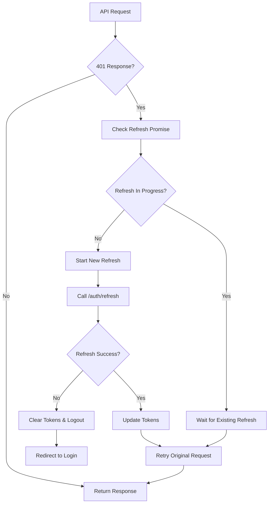

# Authentication System

This document explains the authentication implementation in this project, including security considerations and usage patterns.

## Overview

The authentication system provides:

- Secure token storage and management
- Automatic token refresh
- Race condition protection
- Protected routes

## Architecture

### Components

1. **HTTP Client** (`src/shared/lib/http/client.ts`)
   - Handles all API requests
   - Intercepts 401 responses
   - Manages token refresh

2. **Token Storage** (`src/shared/lib/storage/token-storage.ts`)
   - Secure token storage in memory and sessionStorage
   - Token retrieval and clearing

3. **Auth Feature** (`src/features/auth/`)
   - Authentication hooks and logic
   - Login/logout functionality

4. **Protected Routes** (`src/app/routes/protected-route.tsx`)
   - Route guards for authenticated pages

## Token Storage Strategy

### Access Tokens

- **Storage**: Memory only
- **Purpose**: Short-lived authentication for API requests
- **Security**: Cannot be accessed via XSS attacks
- **Lifetime**: Cleared on page refresh

### Refresh Tokens

- **Storage**: sessionStorage
- **Purpose**: Obtain new access tokens without re-login
- **Security**: Vulnerable to XSS but cleared when tab closes
- **Lifetime**: Survives page refreshes but cleared when tab closes

### Production Recommendations

For production environments, consider:

- HTTP-only secure cookies for refresh tokens
- CSRF protection
- HTTPS only
- Token rotation on each refresh

## Token Refresh Flow



## Race Condition Protection

Multiple simultaneous API calls receiving 401 responses will:

1. Share the same refresh promise
2. Not trigger duplicate refresh requests
3. All wait for the single refresh to complete
4. Retry their original requests with new tokens

## Usage

### Basic Authentication

```typescript
import { useAuth } from '@/features/auth'

const LoginComponent = () => {
  const { login, logout, user, isAuthenticated } = useAuth()

  const handleLogin = async (credentials: LoginCredentials) => {
    try {
      await login(credentials)
      // User is now authenticated
    } catch (error) {
      // Handle login error
    }
  }

  const handleLogout = () => {
    logout()
    // User is logged out and tokens cleared
  }

  return (
    <div>
      {isAuthenticated ? (
        <div>
          <p>Welcome, {user?.name}</p>
          <button onClick={handleLogout}>Logout</button>
        </div>
      ) : (
        <button onClick={() => handleLogin(credentials)}>
          Login
        </button>
      )}
    </div>
  )
}
```

### Protected Routes

```typescript
import { useRequireAuth } from '@/features/auth'

const ProtectedPage = () => {
  // Automatically redirects to login if not authenticated
  useRequireAuth()

  return <div>Protected content</div>
}
```

### Checking Authentication Status

```typescript
import { useAuth } from '@/features/auth'

const MyComponent = () => {
  const { isAuthenticated, user, isLoading } = useAuth()

  if (isLoading) {
    return <div>Loading...</div>
  }

  if (!isAuthenticated) {
    return <div>Please log in</div>
  }

  return <div>Welcome, {user.name}!</div>
}
```

## API Integration

### Automatic Token Handling

The HTTP client automatically:

1. Adds access tokens to requests
2. Handles 401 responses
3. Refreshes tokens when needed
4. Retries failed requests

### Manual Token Management

```typescript
import { tokenStorage } from "@/shared/lib"

// Get current access token
const accessToken = tokenStorage.getAccessToken()

// Check if user is authenticated
const isAuthenticated = tokenStorage.isAuthenticated()

// Clear all tokens (logout)
tokenStorage.clear()
```

## Security Considerations

### Token Storage Security

- Access tokens in memory prevent XSS theft
- Refresh tokens in sessionStorage limit exposure
- Never store sensitive tokens in localStorage

### Error Handling

- Failed refresh attempts trigger logout
- Network errors are handled gracefully
- User session is maintained across refreshes

### Clock Skew Tolerance

- 60-second buffer for token expiration
- Prevents issues with slight time differences
- Ensures smooth user experience

## Configuration

### Environment Variables

```env
# Application Mode
MODE=development

# Application Name
VITE_APP_NAME=React App

# API base URL
VITE_API_URL=http://localhost:3000

# Enable/disable React Query devtools
VITE_ENABLE_DEVTOOLS=true
```

### HTTP Client Configuration

The HTTP client is configured in `src/shared/lib/http/client.ts`:

- Base URL from environment
- Automatic token attachment
- Response interceptors for auth handling
- Error handling and retry logic

## Troubleshooting

### Common Issues

#### Tokens Not Persisting

- Check browser storage settings
- Verify sessionStorage is not cleared
- Check for storage quota issues

#### Refresh Loop

- Verify API endpoints are correct
- Check token expiration times
- Ensure refresh endpoint returns valid tokens

#### Authentication State Not Updating

- Check component re-rendering
- Verify auth context is properly provided
- Check for state update issues

### Debug Tools

Enable development tools to inspect authentication:

```env
VITE_ENABLE_DEVTOOLS=true
```

This provides:

- Authentication state logging
- Token storage inspection
- API request/response monitoring

## Migration Guide

If implementing authentication in an existing project:

1. Set up token storage layer
2. Configure HTTP client with interceptors
3. Create authentication feature
4. Add protected route guards
5. Update components to use auth hooks
6. Test token refresh flow
7. Implement proper error handling
